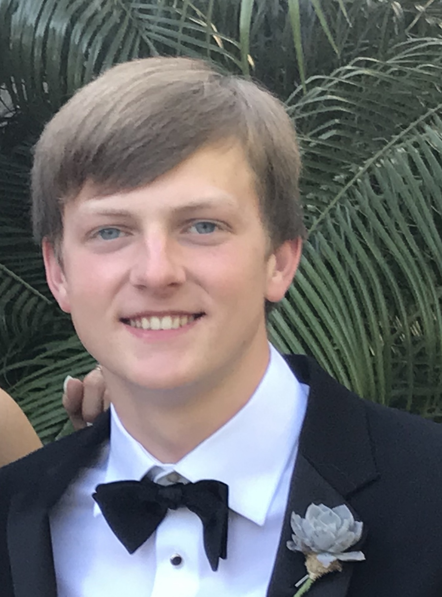

## Welcome to Brett's User Page
[Go To Bottom](#bottom)  
You can find me on LinkedIn [here](https://www.linkedin.com/in/brett-herbst-8810111a3/) to keep up to date on what I am doing professionally!  
Here is what I look like:  

[Extra pic of me](pics/anotherPic.jpg)

I use this pic for everything cause I never take pictures of myself :)

### Who Am I

###### Who I Am As A Programer
I am a 2nd year CS major, and have a little expierence outside of school programing (mainly a 2 summer intership at Texas file). CS 110 will be my first major project but I am super excited to start! 
Random coding fact about me: I hate long if/else if statements like:
```
if(...){
}else if(...){
}else if(...){
}else if(...){
}
ect
```
like dawg cmon just use a switch case- look how clean this looks:
```
switch(...)
{
  case ...:
      ...
      break;
  case ...:
      ...
      break;
  case ...:
      ...
      break;
}
ect
```
###### Who I Am Normally
You can usually find me playing video games(right now Apex Legends) or playing Laccrose for the UCSD club team. I guess I always stay busy, maybe I'm inspired by the words of Robert Stevenson:
> Keep Busy at something: a busy person never has time to be unhappy  

Deep secret of mine- I low key love reality TV but dont tell anyone- here's my favorties   
- Temptation Island
- 90 day fiance
- Are you the One  

Don't tell anyone though it'll tank my social clout  
Im gonna keep it a buck 50 with you, I'm running out of ideas so heres my current check list to finish this lab  
- [x] Part 1
- [x] Part 2
- [ ] Part 3


<a name="bottom"></a>
